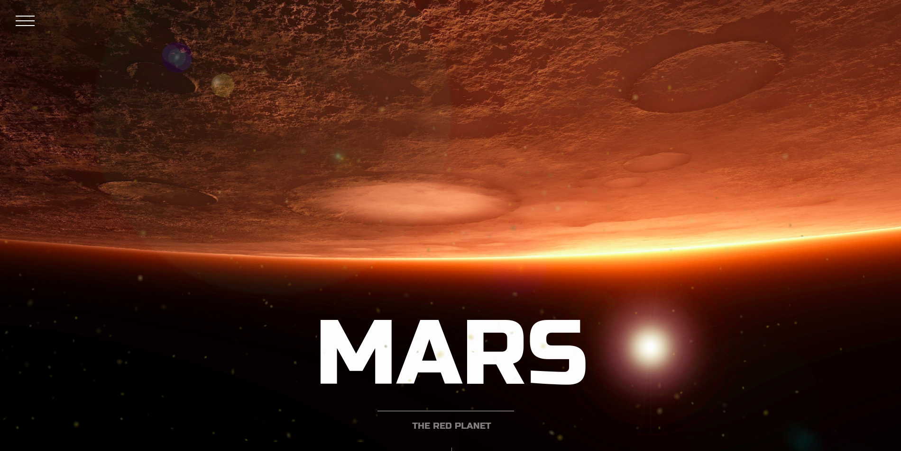

# NASA PROJECT

## Description
This is a personal project with photos of the rover curiosity. consulting the API of NASA.

## Objetives

* Pull data from NASA API.
* Render a galery of data from the API.
* Look (really) pretty!
  
## Setup

* `git clone` this repo
* `cd` into it.
* `yarn`
* `cd client && yarn `
